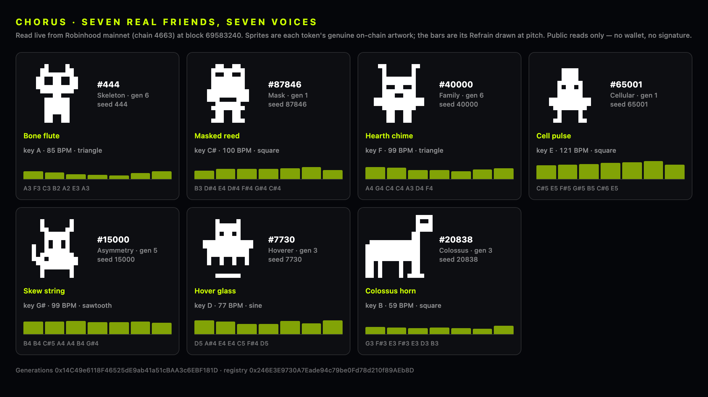
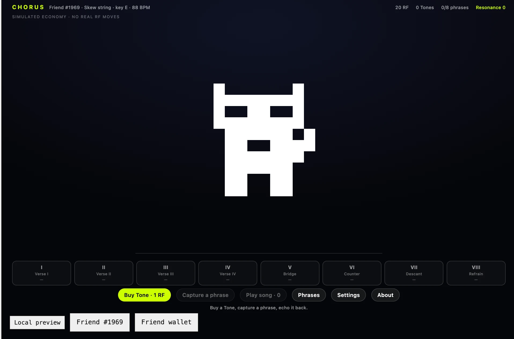

# Chorus

**Every Rare Friend has a song. Spend $RAREFRIENDS to learn it, phrase by phrase,
until you can play the whole thing.**

Chorus reads your selected Generations NFT's own on-chain data and composes music
from it. `familyOf(tokenId)` chooses the instrument and scale; `seedOf(tokenId)`
sets the key, tempo and every note. Both are pure contract functions, so a given
Friend always produces the same song — on any device, in any session, with nothing
saved anywhere.

Then you buy it back one phrase at a time. A phrase you **hold** is audible in
your song. **Redeeming** it returns its simulated RF and removes it from the
arrangement. The song is worth more assembled than cashed out.

- **Builder:** Auri — X [@auri_0x](https://x.com/auri_0x) · GitHub [@0xNad](https://github.com/0xNad)
- **Stack:** FriendSDK **v0.1.2**, React 19, TypeScript, Web Audio
- **Economy:** simulated. No real RF moves, no contracts deployed, no transactions signed.

## Quick start

Needs **Node.js 22+** and a browser wallet on **Robinhood mainnet (chain 4663)**
holding a hardwired Generations NFT, **generation 1 or higher**.

```sh
npm ci
npm run dev
```

Open the printed URL, normally `http://localhost:4173`. Connect your wallet,
choose your Friend, and press **Buy Tone**.

To play from a phone on the same network:

```sh
npm run dev:lan
```

Then open `http://YOUR_LAN_IP:4173` in a wallet browser on the phone.

The FriendSDK package is not published to npm, so it is vendored in `vendor/` as
the archive built from the v0.1.2 source. `npm ci` resolves it from there,
which keeps this repository self-contained and reproducible.

## How to play

1. **Buy a Tone** — 1 simulated RF, confirmed in the SDK's trusted frame.
2. **Capture a phrase** — spends the Tone and draws one phrase from the published
   table below, which then plays.
3. **Echo it** — tap the pad or press **Space** once per note. Optional practice
   that feeds a non-financial Resonance score. It cannot change which phrase you
   drew or what it is worth. **Skip the echo** resolves immediately.
4. **Play song** — plays every phrase you hold, in order.

Duplicates thicken a phrase with extra octave layers, up to three. Redeem the
spares for RF and the phrase stays audible.

## Economy

One consumable, one published outcome table, exactly as the SDK's chance-game
client defines it. All values simulated.

- **Consumable:** Tone — **1.00 RF**
- **Expected reward:** **0.90 RF** per Tone (10% house edge, matching the SDK's fishing reference)
- **Maximum prize:** 7.00 RF — each purchase reserves this much backing

| # | Phrase | Chance | Redeem value |
| --- | --- | --- | --- |
| I | Verse I | 19.00% | 0.55 RF |
| II | Verse II | 18.00% | 0.55 RF |
| III | Verse III | 17.00% | 0.60 RF |
| IV | Verse IV | 15.00% | 0.65 RF |
| V | Bridge | 13.00% | 0.90 RF |
| VI | Counter | 10.00% | 1.20 RF |
| VII | Descant | 6.00% | 2.00 RF |
| VIII | Refrain | 2.00% | 7.00 RF |

Chances total 10000 basis points. Kept phrases retain their RF backing with no
redemption expiry. RF amounts are bigint base units (1 RF = 10^18).

**The outcome table is global and fixed.** A Friend's family and seed change only
what the music sounds like — never the odds, never a reward, never the terms.

## What comes from the chain

| On-chain value | What it determines |
| --- | --- |
| `familyOf(tokenId)` | Instrument voice, waveform and scale — 9 families, 9 voices |
| `seedOf(tokenId)` | Key, tempo and every note of all eight phrases |
| `frames(family, seed)` | The canonical 16×16 sprite, drawn unmodified at an integer scale |

Artwork and registry reads are public and need no wallet. Ownership is verified
separately by the SDK runtime, which Chorus does not reimplement.

Across 27,000 generated family/seed combinations the composer produced **27,000
distinct songs**, every note falling between E2 (82 Hz) and G#6 (1661 Hz). Every
refrain resolves onto the tonic and spans at least three semitones, so no Friend
is handed a monotone payoff phrase.

### Verified against the live chain

Artwork and trait reads are public view/pure functions, so this needs no wallet:

```sh
npm run verify:live        # read real Friends from mainnet and compose their songs
npm run artifact:friends   # render the sheet below
```



Seven real, minted, generation ≥ 1 Friends covering seven of the nine families,
read live from Robinhood mainnet — each with its genuine on-chain sprite and the
song its own family and seed compose:

| Friend | Family | Voice | Key / tempo |
| --- | --- | --- | --- |
| #444 | Skeleton | Bone flute | A @ 85 BPM |
| #87846 | Mask | Masked reed | C# @ 100 BPM |
| #40000 | Family | Hearth chime | F @ 99 BPM |
| #65001 | Cellular | Cell pulse | E @ 121 BPM |
| #15000 | Asymmetry | Skew string | G# @ 99 BPM |
| #7730 | Hoverer | Hover glass | D @ 77 BPM |
| #20838 | Colossus | Colossus horn | B @ 59 BPM |

`verify:live` fails if any two real Friends compose the same song, if any note
falls outside the audible band, or if any Friend would render no pixels.

**Friend #7730, used by the SDK's automated fixture, is itself a real minted
mainnet Friend** (Hoverer, seed 7730), and the SDK's recorded sample frames are
byte-identical to the live registry's. The screenshots in this repository
therefore show a real Friend's real artwork playing its real song; only the
wallet and ownership check are mocked.

### Holder verification



Chorus running on the deployed preview with a real browser wallet on Robinhood
mainnet, for a Friend the player actually owns. The SDK's fresh ownership gate
passed and its picker selected **Friend #1969**, whose canonical artwork is drawn
from a live registry read.

The header reads `Skew string · key E · 88 BPM`. Reading that token independently
from mainnet gives the same thing:

```
$ npm run verify:live -- 1969
Friend #1969
  minted        yes (generation 1)
  family        4 Asymmetry
  seed          1969
  voice         Skew string (sawtooth)
  key / tempo   E @ 88 BPM
```

A Friend nobody had composed for before, matching an independent chain read
exactly. This confirms real-wallet selection, the ownership gate and live artwork
and trait reads for an arbitrary holder-owned token. The session is freshly
loaded — 20 RF, 0 Tones, 0/8 phrases — so it does not itself exercise the
capture loop, which the automated browser check covers instead.

## Accessibility

- **Fully playable with sound off.** Every note is also a bar on the note ribbon
  and a pulse on the Friend. The echo scores identically muted, because its timing
  comes from the composition rather than the audio clock.
- Mute and reduced-motion controls in Settings; `prefers-reduced-motion` honoured.
- Keyboard operable throughout, with visible focus rings.
- Loading, error and retry states for both the session and the artwork read.
- Portrait frame on narrow screens via `host.css`, so phones get a usable layout
  instead of a 240 px-tall strip.

## Checks

```sh
npm run verify          # game validation + both browser checks
npm run build           # static preview bundle into ./dist
```

| Check | Result |
| --- | --- |
| `friendsdk check` | valid; expected reward 0.9 RF, maximum 7 RF |
| Browser check @ 960 px | pass |
| Browser check @ 360 px | pass |
| Echo scoring played in time | 4/4 matched, phrase mastered |
| FriendSDK `npm test` (v0.1.2 checkout) | 116 tests, 114 pass, 0 fail, 2 skipped (contract tests skip without Foundry) |
| `tsc --noEmit` | clean |

The browser check drives the **real** runtime in headless Chromium using the SDK's
read-only wallet/RPC fixtures. It asserts:

- the Friend's canonical artwork resolves from the registry;
- the composed voice, key and tempo match the fixture Friend (family 5, seed 7730
  produces Hover glass in D at 77 BPM);
- buy → capture → hold, and that the phrase lights its rail slot;
- **the capture and play controls stay locked while a phrase is playing**, with a
  spare Tone in hand, so a second capture cannot start over the first;
- **the echo scores when played in time** — the pad is driven on the composed
  77 BPM cadence from inside the page and must master the phrase;
- Resonance rises while the ledger is untouched, since mastery is non-financial;
- redeeming releases the phrase and darkens the slot;
- the mute and reduced-motion controls work, and the reduced-motion toggle
  reaches the CSS and not only the canvas.

Mocks are confined to that automated check; `dev` and `build` keep the real
ownership gate.

**Not covered by the automated check:** the fixture pins the preview roll, so
every settle resolves to outcome 1. The full-resonance state (all eight phrases
held) and the rarer phrases are therefore exercised by hand rather than by the
harness.

## Layout

```
games/chorus/
  index.tsx        game component, interface and interaction
  composition.ts   deterministic song from family + seed
  synth.ts         Web Audio voice; no samples, no network
  game.json        published price and outcome table
  style.css        game styling inside the sandbox
  host.css         trusted-runtime layout, incl. the portrait phone frame
  test.mjs         browser check
```

## Known limitations

- **No persistence.** The SDK sandbox has no storage and the bridge has no save
  API, so held phrases and Resonance last one runtime session. The song itself is
  unaffected — it is recomputed from chain data every time.
- The RF outcome is a weighted draw. Echo accuracy is presentation and a
  non-financial score only; it cannot influence a reward.
- Audio needs a user gesture to start, per browser autoplay rules. If a browser
  refuses an AudioContext the game keeps working silently, and the ribbon still
  shows every note.
- Live on-chain play is not implemented. This is a simulated prototype.

## Credits and licensing

Character artwork is the canonical Rare Friends Generations sprite set, read from
the pinned artwork deployment and drawn unmodified. Music, code, interface and the
note ribbon are original work for this submission; **no third-party audio samples**
— every sound is synthesised by oscillators at runtime.

FriendSDK is Apache-2.0; the vendored archive retains its own licence and NOTICE.
Rare Friends artwork permissions are separate, per the SDK's `NOTICE.md`.
